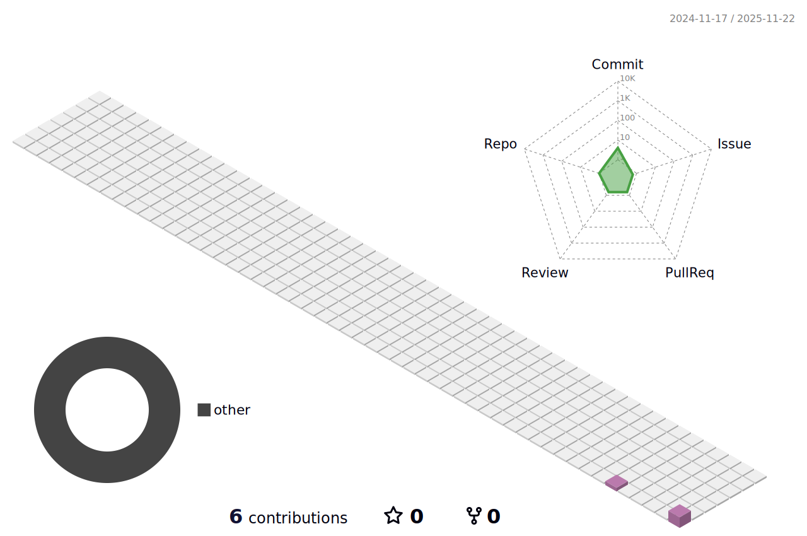

<h1 align="center">Caroline Cristine de Souza</h1>

  Desenvolvedora Backend · Estudante de ADS · Automação RPA · Entusiasta de UX e Produtos Digitais

---

---

## Sobre

- Estudante de Análise e Desenvolvimento de Sistemas (conclusão em 2026)
- Foco em desenvolvimento Backend com Java, Spring Boot, Python e SQL
- Experiência com automação de processos utilizando UiPath
- Conhecimentos em Lógica de Programação, Git, Power BI e Pacote Office
- Interesse em Design Patterns, APIs, UX/UI e desenvolvimento de produtos digitais
